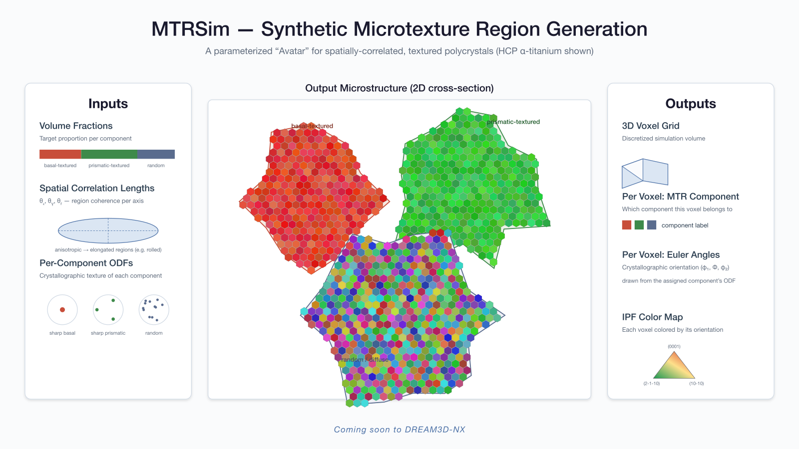
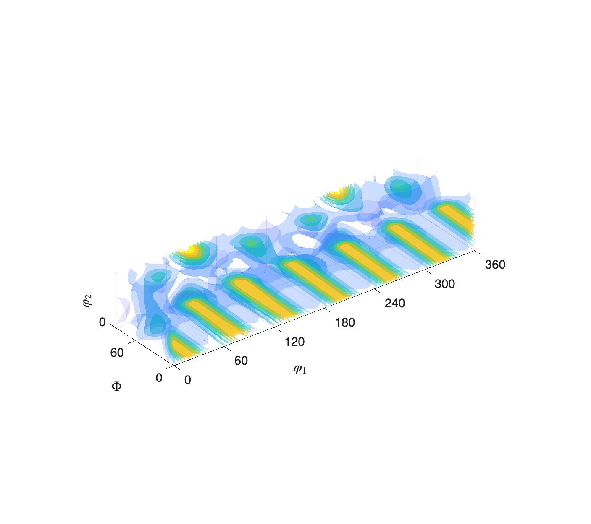
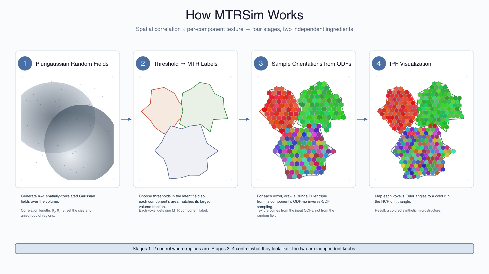

# Generate Synthetic Microtexture

## Group (Subgroup)

MTRSim (Generate)

## Description

This **Filter** runs a plurigaussian random field (PGRF) Micro-Texture Region (MTR) simulation to produce a fully synthetic crystallographic microstructure. Each voxel of the output **Image Geometry** is assigned to one of N microtexture components via correlated latent Gaussian fields and a winner-takes-all assignment rule; a crystallographic orientation is then sampled from that component's Orientation Distribution Function (ODF). The result is a synthetic microstructure with per-voxel MTR ids and Bunge Euler angles (and optional polar coloring), suitable for downstream texture analysis or as a training dataset.

*From per-component volume fractions, spatial correlation lengths (θ), and per-component ODFs (left), MTRSim generates a spatially-correlated, IPF-colored polycrystal cross-section (right). HCP α-titanium is shown.*

The algorithm reproduces the behavior of the MATLAB MTRSim research code (`matlab/simulate_MTRs.m`). Input ODFs are typically prepared by the **Read MTRSim ODF (HDF5)** or **Compute ODF From Euler Angles** filters; the bin layout and axis conventions defined by those filters are used directly by this filter.

*An Orientation Distribution Function (ODF) over Bunge Euler space. One ODF per MTR component defines the crystallographic texture from which each voxel's orientation is drawn.*

### Configuration Source

By default, the simulation parameters (Volume Fraction, Theta List, Physical Size, Physical Spacing, and the seed group) are entered manually in the filter UI.

Enabling **Load Simulation Parameters from Config File** hides those manual fields and instead reads all simulation parameters from a JSON file that follows the same schema used by the standalone MTRSim tool (see `configs/*.json` in the MTRSim repository). This is useful when you already have a validated config file from a prior MATLAB or standalone MTRSim run.

When config-file mode is active:

- The **MTRSim Config File (JSON)** path parameter becomes visible; the manual Simulation Parameters and seed fields are hidden.
- The `odfInputPath` and `nuggetVariance` keys in the JSON are ignored; the ODF always comes from the **Input ODF Geometry** / **ODF Component Arrays** selection in the UI.
- All output array names and paths (output geometry, cell attribute matrix, array names) always come from the UI regardless of mode.
- If the config contains no `seed` key, or `seed: 0`, a time-based random seed is generated automatically — the same behavior as leaving **Use Seed for Random Generation** off in manual mode.
- The **Units Note** below still applies: `xLen`/`yLen`/`zLen`/`dx`/`dy`/`dz` and the theta values in the JSON must all be in a consistent length unit.

### Algorithm Overview

*The MTRSim pipeline: correlated latent Gaussian fields partition the volume into MTR components, then a crystallographic orientation is sampled from each component's ODF.*

The simulation proceeds in the following steps:

1. The ODF grid geometry (bin spacing in degrees) is read from the **Input ODF Geometry**. The component data arrays are assembled in the order specified by **ODF Component Arrays** — this order is critical and must match the Volume Fraction columns.
2. For each pair of adjacent components, a latent Gaussian random field with spatial correlation lengths (`theta_x`, `theta_y`, `theta_z`) drawn from the corresponding row of the **Theta List** is generated over the output domain.
3. A winner-takes-all rule applied to the (N−1) latent fields partitions every voxel into one of the N MTR components. The expected volume fraction of each component is controlled by the **Volume Fraction** parameter.
4. Each voxel draws a Bunge Euler triple (`phi1`, `PHI`, `phi2`) by inverse-CDF sampling from its assigned component's ODF.
5. If **Generate Polar Coloring** is enabled, the Euler angles are mapped to an RGB color using the HCP polar (MATLAB Sparkman) color scheme, looking along the Z reference direction.

### Units Note (Important)

**Physical Size**, **Physical Spacing**, and the **Theta List** correlation lengths must all use the **same length unit**. Only the dimensionless ratio (lag / theta) enters the Gaussian covariance calculation, so mixing units (e.g., microns for size but millimeters for theta) will produce physically incorrect correlation lengths. The original MATLAB MTRSim defaults used millimeter-scale values; if you import those defaults directly into this filter with micron-scale size/spacing, scale the theta values by 1000 to match.

### Preflight Preview

The **Filter** reports the following derived values before the user clicks Apply:

- **Output Grid (X, Y, Z):** the voxel dimensions of the output geometry, computed as `round(Size / Spacing)` on each axis (Z is forced to 1 when Physical Size Z ≤ 0).
- **Number of ODF Components:** the number of paths selected in **ODF Component Arrays**.

### Performance

The simulation runs in the execute phase. For large output grids (e.g., the default ~1900 × 635 grid) this may take a substantial amount of time. Progress is reported continuously throughout the simulation — covering plurigaussian field generation and per-component orientation sampling — so the progress bar advances incrementally rather than jumping from 0 % to 100 %. The filter also checks for cancellation continuously; if cancelled mid-run, the filter returns without populating the output arrays with simulation results (the arrays exist but remain unfilled).

## Outputs

A new **Image Geometry** (default path `MTR Microstructure`) is created with a cell **Attribute Matrix** (default `Cell Data`) containing the following arrays:

| Array | Type | Components | Contents |
|---|---|---|---|
| MTRIds | Int32 | 1 | Per-voxel MTR component id, 1-based (0 is reserved, consistent with the FeatureIds convention). |
| Eulers | Float32 | 3 | Bunge Euler angles `(phi1, PHI, phi2)` in **radians**. |
| Polar Colors | UInt8 | 3 (RGB) | HCP polar coloring; present only when **Generate Polar Coloring** is enabled. |

A scalar `UInt64` array (default name `MTRSim SeedValue`) is created at the top level of the **DataStructure** to record the seed actually used during execution, enabling exact replay of the simulation.

## Downstream Tips

- Follow this filter with **Compute IPF Colors** (using the Eulers output) for a standard inverse-pole-figure visualization.
- Use **Write Image** to export slice images from the output geometry.
- The MTRIds array is compatible with downstream feature-level statistics filters that consume a `FeatureIds`-style Int32 array.

## Errors

| Code | Meaning |
| --- | --- |
| `-13501` | (Preflight) Fewer than 2 ODF component arrays were selected. MTRSim requires at least 2 components. |
| `-13502` | (Preflight) The **Volume Fraction** table must have exactly 1 row and exactly one column per ODF component. |
| `-13507` | (Preflight) One or more Volume Fraction values is outside the range [0, 1]. |
| `-13503` | (Preflight) Volume Fraction values do not sum to 1.0 (tolerance: 1 × 10⁻³). |
| `-13504` | (Preflight) The **Theta List** has fewer than (components − 1) rows. Each pair of adjacent components requires one latent Gaussian field with its own correlation lengths. |
| `-13505` | (Preflight) A row in the **Theta List** does not have exactly 3 columns (`theta_x`, `theta_y`, `theta_z`). |
| `-13506` | (Preflight) Physical Spacing X or Y is ≤ 0. Both must be strictly positive; the Z spacing is unused when Physical Size Z ≤ 0. |
| `-13520` | (Preflight) The MTRSim config file is missing or invalid (cannot be opened / not valid JSON). Only reported when **Load Simulation Parameters from Config File** is ON. |
| `-13521` | (Execute) The MTRSim config file could not be read at execute time (missing or invalid). Only reported when **Load Simulation Parameters from Config File** is ON. |
| `-13550` | (Execute) The core MTR simulation threw an unexpected exception. The error message includes the underlying cause. |

% Auto generated parameter table will be inserted here

## Example Pipelines

(Example pipelines will be added in a future release.)

## License & Copyright

Please see the description file distributed with this plugin.

## DREAM3D Mailing Lists

If you need help, need to file a bug report or want to request a new feature, please head over to the [DREAM3DNX-Issues](https://github.com/BlueQuartzSoftware/DREAM3DNX-Issues/discussions) GitHub site where the community of DREAM3D-NX users can help answer your questions.
